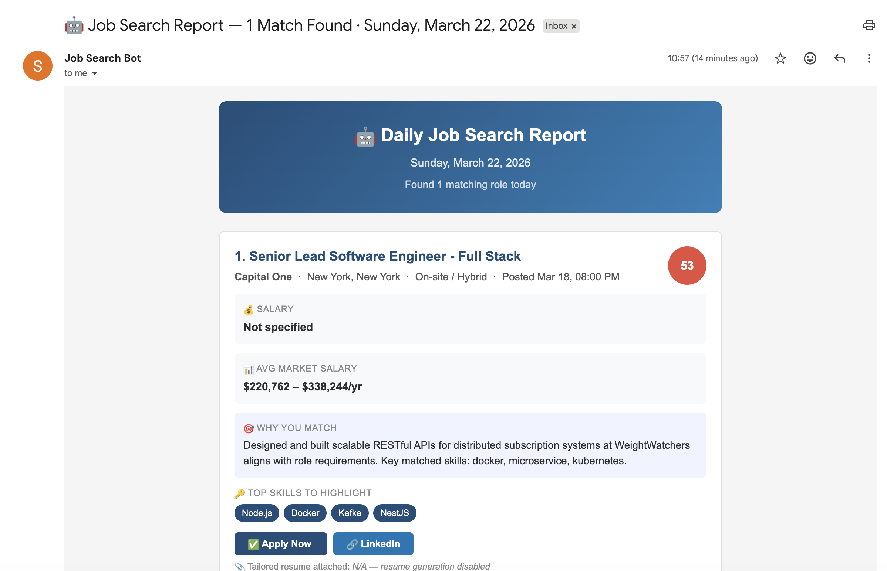
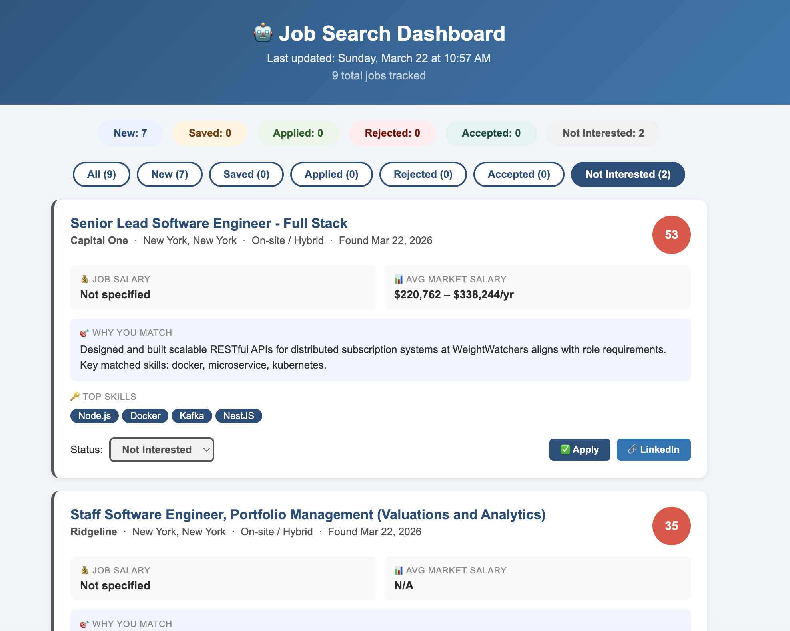

# 🤖 Daily Job Search Bot

### Automated job search + tailored resume generator — runs every morning while you sleep


---

## 📸 Preview

**Daily Email Report**



**Job Tracker Dashboard**



---

## 🎯 What It Does

Every weekday morning, this bot automatically:

1. 🔍 **Searches job boards** (Indeed, LinkedIn, Glassdoor & more) for new jobs matching your profile
2. 🎯 **Scores each job** by how well it matches your skills (0–100)
3. 📄 **Generates a tailored `.docx` resume** for every strong match
4. 🔗 **Generates a LinkedIn search link** for each company
5. 📊 **Fetches average market salary** for each role via Glassdoor
6. 📬 **Emails you a beautiful report** with all resumes attached — ready to apply!
7. 📋 **Generates a local dashboard** (`data/dashboard.html`) to track job statuses (New, Saved, Applied, Rejected, Accepted, Not Interested)

You wake up, open your email, and your job search is already done. ☕

---

## 💰 Cost

| Service            | Plan                                                      | Cost         |
| ------------------ | --------------------------------------------------------- | ------------ |
| GitHub Actions     | Free (2,000 min/month)                                    | **$0**       |
| RapidAPI JSearch   | Free tier — aggregates Indeed, LinkedIn, Glassdoor & more | **$0**       |
| RapidAPI Glassdoor | Free tier — company ratings & salary insights             | **$0**       |
| Gmail SMTP         | Free                                                      | **$0**       |
| **Total**          |                                                           | **$0/month** |

> ⚠️ Watch your monthly request limit on the free tier.
> Want more searches? [Check JSearch pricing](https://rapidapi.com/letscrape-6bRBa3QguO5/api/jsearch/pricing) to upgrade.

---

## 🚀 Setup Guide (~20 minutes, one time only)

### Step 1 — Fork this repository

Click **Fork** → set to **Private**

### Step 2 — Fill in your profile

Edit `config/profile.json` with your own information — the file is fully commented with example values. Key fields:

> 💡 **Pro tip:** Upload your resume + `config/profile.json` to ChatGPT and ask it to fill in the JSON based on your resume. No manual editing needed!

```json
{
  "personal": { "name": "John Smith", "email": "john@gmail.com", "..." },

  "skills": {
    "backend": ["Node.js", "NestJS", "..."],
    "languages": ["TypeScript", "Python", "..."]
  },

  "experience": [
    {
      "title": "Senior Software Engineer",
      "company": "Company Name",
      "dates": "Jan 2023 – Present",
      "bullets": ["Built X using Y...", "..."]
    }
  ],

  "job_preferences": {
    "search_titles": ["Senior Software Engineer", "Senior Backend Engineer"],
    "locations": ["New York, NY", "remote"],
    "min_salary": 130000,
    "title_include": ["senior", "lead", "..."],
    "title_exclude": ["junior", "intern", "..."]
  },

  "search_config": {
    "themes": {
      "payments": {
        "keywords": ["payment", "billing", "..."],
        "skills": ["Node.js", "Kafka", "..."],
        "score": 10
      }
    },
    "summaries": { "payments": "Your payments-focused summary...", "default": "Your general summary..." },
    "match_reasons": { "payments": "Your X years in payments aligns with...", "default": "..." }
  }
}
```

> 💡 **Tips:**
>
> - `experience.bullets` — use action verbs and add numbers/metrics where possible (%, $, users, etc.). The bot reorders them per job to highlight the most relevant ones first.
> - `min_salary` — jobs below this value are filtered out automatically.
> - `title_include` — job title must contain at least one of these words to be included.
> - `title_exclude` — jobs with any of these words in the title are filtered out.
> - `client` — set to `null` for direct employment, or add client name if consulting.
> - `search_config` — controls how jobs are themed, scored, and summarized. See the "Personalize the search engine" section below.

---

### Step 3 — Get your free API keys

#### A. RapidAPI Key (JSearch + Glassdoor)

1. Sign up free at [rapidapi.com](https://rapidapi.com)
2. Search **"JSearch"** → Subscribe to the **Free plan**
3. Search **"Real-Time Glassdoor Data"** → Subscribe to the **Free plan**
4. Go to **My Apps → Application Keys** → copy your key (one key works for both APIs!)

> 📍 Can't find the key? Go to the JSearch page → look for `"X-RapidAPI-Key"` in the Code Snippets panel on the right

#### B. Gmail App Password

1. Go to [myaccount.google.com](https://myaccount.google.com) → **Security**
2. Enable **2-Step Verification** (required!)
3. Search **"App Passwords"** → Generate one → name it `JobBot`
4. Copy the 16-character code and paste it as your secret value

### Step 4 — Add secrets to GitHub

Repo → **Settings → Secrets and variables → Actions → New repository secret**

| Secret Name          | Value                             |
| -------------------- | --------------------------------- |
| `RAPIDAPI_KEY`       | Your RapidAPI key                 |
| `GMAIL_SENDER`       | Your Gmail address                |
| `GMAIL_APP_PASSWORD` | 16-char App Password              |
| `GMAIL_RECIPIENT`    | Where to receive the daily report |

### Step 5 — Enable the daily schedule

The workflow is already included in the repo. To enable automatic daily runs, uncomment the schedule in `.github/workflows/daily_job_search.yml`:

```yaml
on:
  # ✏️ Uncomment the lines below to enable daily scheduling
  # schedule:
  #   - cron: '0 13 * * 1-5' # Mon–Fri 9:00 AM EDT / 8:00 AM EST (UTC-based, always)
  workflow_dispatch:
```

### Step 6 — Test it now!

1. **Actions** tab → **"🤖 Daily Job Search"**
2. **"Run workflow"** → **"Run workflow"**
3. Watch the logs (~3 minutes) → check your inbox! 📬

---

## ⚙️ Customizing

### 🌍 Change locations and job titles

Edit `search_titles` and `locations` in `config/profile.json` — the bot automatically searches every title × location combination:

```json
"job_preferences": {
  "search_titles": ["Senior Software Engineer", "Senior Backend Engineer"],
  "locations": ["New York, NY", "remote"]
}
```

> The example above generates 4 searches (2 titles × 2 locations).

Supported countries:

| Country           | Include in location string  |
| ----------------- | --------------------------- |
| 🇺🇸 United States  | `"New York NY"`, `"remote"` |
| 🇯🇴 Jordan         | `"Amman Jordan"`            |
| 🇸🇦 Saudi Arabia   | `"Riyadh Saudi Arabia"`     |
| 🇬🇧 United Kingdom | `"London UK"`               |
| 🇨🇦 Canada         | `"Toronto Canada"`          |
| 🇦🇺 Australia      | `"Sydney Australia"`        |
| 🇩🇪 Germany        | `"Berlin Germany"`          |
| 🇫🇷 France         | `"Paris France"`            |
| 🇮🇳 India          | `"Bangalore India"`         |

### Tune job results

Edit `config/settings.js`:

```js
// Minimum match score to include a job (0–100)
// Lower = more results but less relevant
// Higher = fewer results but stronger matches
export const MIN_MATCH_SCORE = 50;

// Max jobs to process per day
// Keep low when GENERATE_RESUMES = true (each resume takes time to generate)
// Raise it when GENERATE_RESUMES = false (just email, no file generation)
export const MAX_JOBS_PER_RUN = 5;

// Set to false to skip .docx resume generation
// You'll still get the full email report — just no attachments
export const GENERATE_RESUMES = true;

// How recent jobs to fetch
// Valid values: "today", "3days", "week", "month"
export const DATE_POSTED = '3days';

// Set to false to skip sending the daily email report
// The dashboard will still be updated regardless of this setting
export const SEND_EMAIL = true;

// Set to false to skip Glassdoor API calls (rating + salary)
// Useful when you're close to your monthly API limit (100 req/month free)
export const FETCH_GLASSDOOR = true;
```

### 🎯 Personalize the search engine

All customizable data lives in **one file** — `config/profile.json`, under the `search_config` key.
You don't need to touch any script files to personalize the bot!

The `search_config` section has 3 fields — each clearly marked with what to change:

| Field           | What it controls                                                          |
| --------------- | ------------------------------------------------------------------------- |
| `themes`        | Keywords to detect job type + skills to highlight per theme (all-in-one!) |
| `summaries`     | Your professional summary shown at the top of each resume                 |
| `match_reasons` | "Why You Match" text shown in your email report                           |

Example — personalizing `match_reasons`:

```json
"match_reasons": {
  "payments": "Your X years in payments/fintech at [Company] handling X transactions/day aligns with this role.",
  "eventDriven": "Your Kafka/event-driven work at [Company] reducing processing time by X% matches this role's focus.",
  "devex": "Your CI/CD and platform engineering experience at [Company] improving deploy speed by X% fits this role.",
  "default": "Your engineering background matches several key requirements in this job description."
}
```

### Change the schedule time

Once enabled, you can adjust the timing in `.github/workflows/daily_job_search.yml`:

```yaml
on:
  # ✏️ Uncomment the lines below to enable daily scheduling
  # schedule:
  #   - cron: '0 13 * * 1-5' # Mon–Fri 9:00 AM EDT / 8:00 AM EST (UTC-based, always)
  workflow_dispatch: # manual trigger always stays on
```

Common schedule options (GitHub Actions cron always runs in **UTC**):

```yaml
# Format: minute hour * * days (1-5 = Mon–Fri)
- cron: '0 14 * * 1-5' # 9:00 AM EST / 10:00 AM EDT
- cron: '30 13 * * 1-5' # 8:30 AM EST / 9:30 AM EDT
- cron: '0 9 * * 1-5' # 9:00 AM UTC (adjust for your timezone)
- cron: '0 14 * * *' # 9:00 AM EST every day including weekends
```

---

## 📁 Project Structure

```
daily-job-search-bot/
├── .github/
│   └── workflows/
│       └── daily_job_search.yml    # GitHub Actions scheduler
├── scripts/
│   ├── jobSearch.js                # Main orchestrator
│   ├── searchEngine.js             # Matching logic (don't edit)
│   ├── resumeGenerator.js          # Builds tailored .docx resumes
│   ├── emailSender.js              # Gmail HTML report sender
│   ├── glassdoorClient.js          # Glassdoor rating & salary insights
│   ├── jobsTracker.js              # Persists all jobs to data/jobs.json
│   ├── dashboardGenerator.js       # Generates static HTML dashboard
│   └── dashboardClient.js          # Dashboard browser-side JS
├── templates/
│   └── dashboard.html              # Dashboard HTML/CSS template
├── config/
│   ├── profile.json                # ✏️ Your personal data, skills, experience & search config
│   └── settings.js                 # ✏️ Bot tunables: score threshold, max jobs, resumes on/off
├── data/
│   ├── searched_jobs.json          # Auto-created: no duplicate alerts
│   ├── jobs.json                   # Auto-created: all tracked jobs with status
│   └── dashboard.html              # Auto-created: open in browser to track jobs
├── output/
│   └── YYYY-MM-DD/                 # Auto-created: daily resume files
├── .env.example                    # Template for local testing
├── package.json
└── README.md
```

---

## 🧪 Running Locally

```bash
# 1. Clone the repo
git clone https://github.com/YOUR_USERNAME/daily-job-search-bot.git
cd daily-job-search-bot

# 2. Install dependencies
npm install

# 3. Set up local secrets
cp .env.example .env
# Edit .env with your keys

# 4. Run it!
npm start
```

---

## 🛠 Troubleshooting

| Problem                 | Fix                                                                                                    |
| ----------------------- | ------------------------------------------------------------------------------------------------------ |
| No email received       | Check Actions logs for ❌. Verify all 4 secrets are correct.                                           |
| "0 jobs found"          | Change `DATE_POSTED` in `config/settings.js` — valid values: `"today"`, `"3days"`, `"week"`, `"month"` |
| All scores too low      | Lower `MIN_MATCH_SCORE` in `config/settings.js`                                                        |
| RapidAPI limit hit      | Reduce searches or [upgrade your plan](https://rapidapi.com/letscrape-6bRBa3QguO5/api/jsearch/pricing) |
| Can't find App Password | Enable 2-Step Verification in Google Account first                                                     |

---

## 🗺 Roadmap

- [x] Indeed search via RapidAPI
- [x] Smart keyword-based resume tailoring
- [x] Tailored `.docx` resume per job
- [x] LinkedIn company page finder
- [x] Beautiful HTML email report
- [x] Deduplication (never see same job twice)
- [x] Global search support (US, Jordan, Saudi, UK...)
- [x] Resume generation toggle
- [x] Average market salary insights via Glassdoor (RapidAPI)
- [x] Job tracker dashboard (applied / saved / rejected / accepted / not interested)
- [ ] Resume profile generator (upload your resume → auto-generate `config/profile.json`)
- [ ] AI-powered job application package (tailored resume + cover letter per job)
- [ ] Automated job application submission
- [ ] Rejection detection via email parsing

---

## ⭐ Support

If this project helped you, please give it a **star on GitHub** —
it helps other developers find it and motivates me to keep improving it!

[](https://github.com/dahboorSa/daily-job-search-bot)

---

## 👩‍💻 Author

Made with 🌸 by **Sebaa Dahboor**

[](https://www.linkedin.com/in/saba-dahboor/)

---

## 📄 License

MIT — free to use, modify, and share.
